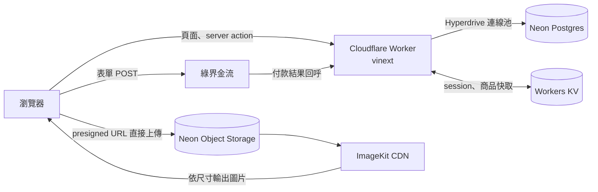

# 找茶 spot-tea

個人獨立開發的台灣茶葉電商。從瀏覽商品、購物車、結帳、綠界信用卡付款，到會員中心與後台出貨管理，完整走完一筆訂單的生命週期。
以 vinext（Next.js App Router 相容）打造，部署在 Cloudflare Workers。

**Demo：<https://spot-tea.cyuan.workers.dev>**

> 信用卡付款串接的是綠界測試環境，可用綠界公開的測試卡號 `4311-9522-2222-2222`
> （安全碼任意三碼、有效期限任意未來月年、3D 驗證碼 `1234`）走完付款流程。

## 作品截圖

<table>
  <tr>
    <th width="50%">首頁</th>
    <th width="50%">商品頁</th>
  </tr>
  <tr>
    <td align="center"></td>
    <td align="center"></td>
  </tr>
  <tr>
    <th width="50%">購物車</th>
    <th width="50%">結帳</th>
  </tr>
  <tr>
    <td align="center"></td>
    <td align="center"></td>
  </tr>
  <tr>
    <th width="50%">會員中心</th>
    <th width="50%">我的訂單</th>
  </tr>
  <tr>
    <td align="center"></td>
    <td align="center"></td>
  </tr>
  <tr>
    <th width="50%">商品收藏</th>
    <th width="50%">門市資訊</th>
  </tr>
  <tr>
    <td align="center"></td>
    <td align="center"></td>
  </tr>
  <tr>
    <th width="50%">後台儀表板</th>
    <th width="50%">後台商品管理</th>
  </tr>
  <tr>
    <td align="center"></td>
    <td align="center"></td>
  </tr>
  <tr>
    <th width="50%">後台商品分類</th>
    <th width="50%">後台訂單管理</th>
  </tr>
  <tr>
    <td align="center"></td>
    <td align="center"></td>
  </tr>
  <tr>
    <th width="50%">訂單明細、訂單狀態</th>
    <th width="50%">使用者管理</th>
  </tr>
  <tr>
    <td align="center"></td>
    <td align="center"></td>
  </tr>
</table>

## 專案亮點

- **完整的電商流程**：顧客下單付款、管理員備貨出貨、顧客查詢與取消訂單，前後台都實際串到資料庫與金流。
- **重視資料正確性**：庫存在資料庫端以帶條件的 `UPDATE` 扣減，防止超賣；
  訂單狀態只能依序往前推，每一次變更都留下操作紀錄。
- **真實金流串接**：綠界全方位金流信用卡付款，處理 CheckMacValue 驗證、重複通知與付款失敗重付。
- **在嚴格限制下做架構取捨**：Cloudflare Workers 免費方案每個請求只有 10ms CPU、
  KV 每天只有 1,000 次寫入，密碼雜湊、快取策略與圖片上傳都依此設計。
- **型別安全延伸到邊界**：環境變數、表單與 server action 的輸入都經過 zod 驗證，
  Drizzle ORM 讓資料庫 schema 與查詢結果的型別保持一致。

## 功能

**顧客**

- 首頁依茶區選購、最新上架；商品列表可依茶區篩選、邊打邊搜、分頁
- 商品頁依重量選規格、加入收藏
- 購物車、結帳、門市資訊
- 付款方式：綠界信用卡、貨到付款、ATM 匯款；滿 NT$1,500 免運，未滿收 NT$120

**會員中心**

- 修改名稱與密碼、裁切後上傳大頭貼
- 我的訂單：查看處理進度，出貨前可自行取消
- 商品收藏

**管理後台**

- 儀表板：已付款營收、訂單數、會員數、上架商品數，以及最新訂單與低庫存提醒
- 商品管理：多重量規格、圖片上傳、批次上下架與刪除；商品分類管理
- 訂單管理：依步驟推進訂單與付款狀態
- 會員管理：新增會員、調整角色、停權，並列出每位會員的累計消費
- 所有表格皆支援搜尋、排序與分頁

Email 驗證與忘記密碼已實作（Resend 寄信），因尚未綁定自訂網域，暫未啟用。

## 技術棧

| 類別       | 技術                                                      |
| ---------- | --------------------------------------------------------- |
| 框架       | vinext（Next.js 相容，以 Vite 建置）、React                 |
| 執行環境   | Cloudflare Workers                                        |
| 資料庫     | Neon Postgres、Drizzle ORM、Cloudflare Hyperdrive         |
| 快取       | Workers KV                                                |
| 身分驗證   | Better Auth（含 admin plugin）                            |
| 檔案儲存   | Neon Object Storage（S3 相容）、ImageKit CDN              |
| 金流       | 綠界全方位金流（AIO）                                     |
| 寄信       | Resend                                                    |
| UI         | Tailwind CSS、shadcn/ui、TanStack Table                   |
| 表單與驗證 | React Hook Form、Zod                                      |
| 測試       | Vitest                                                    |
| 開發工具   | TypeScript、pnpm、oxlint、oxfmt                           |

## 系統架構



- **Cloudflare Workers**：頁面、server action 與 API 都跑在同一個 Worker 上，
  並固定在離資料庫最近的區域（`aws:ap-southeast-1`）。
- **Hyperdrive**：Worker 的每個請求都是短暫的執行環境，由 Hyperdrive 維持到 Neon 的連線池，
  省下每次重新建立連線的成本。
- **Workers KV**：快取 Better Auth 的 session，以及前台的商品與分類清單。
  資料庫仍是唯一的真實來源，商品、分類或庫存變動時以標籤讓快取失效。
- **Neon Object Storage + ImageKit**：商品圖與大頭貼由瀏覽器直接上傳，
  對外經 ImageKit CDN 依螢幕尺寸產生 srcset。

## 技術挑戰與解法

### 1. 結帳：防止超賣與竄改價格

**問題**：購物車存在瀏覽器，送來的價格不可信；兩位顧客同時搶最後一件商品時，「先讀庫存、算好再寫回」會發生 lost update。

**做法**：
- client 只送規格與數量，品名、單價與庫存一律在 server 從資料庫重新查詢。
  價格有變動時，帶回最新單價請顧客確認後再送出。
- 扣庫存用帶條件的 `UPDATE ... SET stock = stock - n WHERE stock >= n`，由資料庫原子相減。
  後到的那筆命中 0 列，整筆交易連同已扣的庫存一起 rollback，顧客會看到庫存不足的提示。

### 2. 訂單狀態機：禁止跳步，擋下併發操作

**問題**：後台若提供可任意編輯的表單，狀態可能被改錯、也無從追查是誰改的；
兩位管理員同時操作，或其中一人的畫面已經過期時，會互相覆蓋。

**做法**：

- 訂單狀態只能依序往前推（待處理 → 備貨中 → 已出貨 → 已完成，出貨前可取消），
  付款狀態獨立記錄（未付款 → 已付款 → 已退款）。後台只有「下一步」按鈕，沒有編輯表單。
- 允許的前一個狀態直接寫進 `UPDATE` 的 `WHERE`，業務規則也一併放進條件
  （信用卡與 ATM 匯款要先付款才能備貨，貨到付款例外）。畫面過期或同時操作只會命中 0 列，
  回傳「訂單狀態已經變更，請重新整理」。
- 在同一筆交易裡寫入 `order_event`，記下每一次變更與操作的管理員；取消訂單時補回庫存。

### 3. 綠界金流：重複與不保證順序的付款通知

**問題**：綠界會把付款結果同時送到 ReturnURL（server 對 server）與 OrderResultURL（導回瀏覽器），
兩者內容相同、不保證誰先到，通知也可能重送。

**做法**：

- 兩個端點共用同一段處理：先驗證 CheckMacValue 與特店編號，
  再以 `WHERE payment_status = 'unpaid'` 回寫。先到的寫入，後到與重送的命中 0 列，
  不會重複入帳，也不會重複記錄歷程。
- 綠界後台「模擬付款」產生的通知（`SimulatePaid=1`）沒有真的收到錢，不會標記為已付款。
- 付款失敗或中途離開時，訂單維持未付款，可在訂單完成頁重新付款。

### 4. 追進框架原始碼，找出正式環境的重導向迴圈

**問題**：會員中心在本機一切正常，部署後卻出現 Cloudflare 1101 錯誤「Too many redirects」。

**原因**：追進 `@vinext/cloudflare` 的 CDN adapter 原始碼後發現，
它把頁面渲染交給另一個啟用快取的 Worker 入口，而這個內部 `fetch` 漏設了 `redirect: "manual"`
（同一套件的其他內部請求都有設）。頁面回傳的 307 因此被 Worker 自己跟隨，
重新渲染同一頁、再回 307，直到超過重導向上限。

**做法**：頁面不再呼叫 `redirect()`，登入與權限的轉址移到 `proxy.ts`（middleware）。
它執行在不經內部轉送的入口，307 能正常回到瀏覽器。頁面本身只負責在 session 失效時顯示提示畫面。

### 5. 在 Workers 免費方案的限制下設計

- **每個請求只有 10ms CPU**：Better Auth 預設的 scrypt 在 Workers 上要花數百 ms，登入必定超時。
  改用 Web Crypto 原生的 PBKDF2 覆寫密碼雜湊，迭代次數存進 hash 本身，之後調整也不會讓舊密碼失效。
  （Workers 的 PBKDF2 迭代上限只在正式環境生效，本機測不出來，這點也寫進了註解。）
- **KV 每天只有 1,000 次寫入**：若為每組篩選參數開一個 cache key，任何人亂打的關鍵字都會多消耗一次寫入。
  改成整份型錄只快取一個 key，茶區篩選、關鍵字搜尋與分頁都在記憶體中完成。
- **圖片上傳不經過 Worker**：server 只簽發 presigned URL，瀏覽器直接 PUT 到物件儲存，
  不佔用 Worker 的 CPU 與請求大小限制。

### 6. 時區

Worker 執行在 UTC，但訂單日期與訂單編號（`ST-YYYYMMDD-NNNN`）都應以台灣時間計算。
日期一律以 `Asia/Taipei` 計算與顯示，避免午夜前後的訂單被算到前一天。

## 資料模型

- `user` / `session` / `account` / `verification`：Better Auth 的資料表，含 admin plugin 的角色與停權欄位。
- `category` / `product` / `product_variant`：商品依重量分規格，價格與庫存記在規格上。
- `order` / `order_item` / `order_event`：訂單狀態與付款狀態分開記錄；
  訂單明細保存下單當下的品名與單價；`order_event` 記錄每一次狀態變更與操作者。
- `favorite`：以 (user_id, product_id) 為複合主鍵。

## 測試

單元測試放在被測模組旁（`*.test.ts`），以 Vitest 執行，著重在出錯代價高的商業規則：
運費計算、訂單狀態轉移、訂單編號、綠界 CheckMacValue、密碼雜湊、
登入後的安全轉址（防止 open redirect），以及各表單的 zod schema。

## 📁專案結構

依功能（feature-based）組織：

```
root/
├── app/                      
│   ├── (admin)/
|   |   ├── admin/                  # 後台管理
|   |   |   ├── dashboard/          # 儀表板
|   |   |   ├── products/           # 商品管理
|   |   |   ├── categories/         # 商品分類
|   |   |   ├── orders/             # 訂單管理
|   |   |   └── users/              # 使用者管理
|   |   ├── layout.tsx              # 後台佈局
|   |   ├── loading.tsx             # 後台載入畫面
|   |   └── error.tsx               # 後台錯誤頁面
│   ├── (auth)/
|   |   ├── login/                  # 會員登入
|   |   ├── signup/                 # 會員註冊
|   |   ├── verify-email/           # 信箱驗證
|   |   ├── forgot-password/        # 忘記密碼
|   |   ├── reset-password/         # 重設密碼
|   |   └── layout.tsx              # 登入、註冊佈局
│   ├── (shop)/
|   |   ├── products/               # 前台商品列表
|   |   ├── cart/                   # 購物車
|   |   ├── checkout/               # 結帳
|   |   ├── store-location/         # 門市資訊
|   |   ├── layout.tsx              # 前台佈局
|   |   └── page.tsx                # 前台首頁
│   ├── (user)/
|   |   ├── user/                   # 前台會員
|   |   |   ├── orders/             # 我的訂單
|   |   |   ├── favorites/          # 商品收藏
|   |   |   └── page.tsx            # 會員中心
|   |   └── layout.tsx              # 會員佈局
│   ├── api/
|   |   ├── auth/                   # Auth API authentication
|   |   └── payments/         
|   |       └── ecpay/              # 綠界 API
|   |           ├── notify/         # 綠界 ReturnURL：付款結果 Server 對 Server 的通知
|   |           └── result/         # 綠界 OrderResultURL：消費者付款後，綠界付款頁以 form POST 把瀏覽器帶回這裡
│   ├── layout.tsx                  # RootLayout
│   ├── error.tsx                   # 全站的錯誤邊界
│   ├── not-found.tsx               # 網址輸入錯誤顯示的頁面
│   ├── globals.css                 # shadcn/ui Theme
│   ├── sitemap.ts                  # 網站地圖
│   └── robots.txt                  # 爬蟲引導
├── components/
│   ├── common/                     # 全站共用元件
│   ├── layout/               
|   |   ├── admin/
|   |   |   ├── AdminHeader.tsx     # 後台頁首
|   |   |   ├── AdminNavMain.tsx    # 後台導覽
|   |   |   └── AdminSidebar.tsx    # 後台側邊欄
|   |   ├── Navbar.tsx              # 前台頁首
|   |   ├── Footer.tsx              # 前台頁尾
|   |   ├── MobileMenu.tsx          # 手機版菜單
|   |   ├── NavUser.tsx             # 導覽元件的使用者資訊
|   |   └── SiteChrome.tsx          # 前台共用佈局 
│   └── ui/                         # shadcn/ui
├── db/
│   ├── queries/                    # 資料庫查詢
│   ├── relations/                  # 資料庫關聯
│   ├── schema/                     # 資料表結構
│   ├── client.ts                   # 資料庫連線
│   └── migrate.ts                  # 資料庫遷移
├── drizzle/                        # 根據 schema 產生的 sql migration
├── features/                       # 功能模組
├── hooks/                          # React Custom Hooks
├── lib/                            # Better Auth / Resend / format / imageKit / Neon Object Storage
├── env.ts      # 有型別的環境變數
├── neon.ts     # Neon 設定
├── proxy.ts     # 登入判斷：樂觀檢查 cookie 是否存在
├── .env.example      # 環境變數參考範本
├── .gitignore        # Git 忽略追蹤清單
├── package.json      # 專案依賴與執行指令
└── README.md         # 專案說明
```

## 本機執行

需要 Node.js、pnpm，以及 Neon 與 Cloudflare 帳號。

```sh
pnpm install
cp .env.example .env.local   # 填入環境變數
pnpm db:migrate
pnpm db:seed                 # 寫入示範分類與商品
pnpm dev                     # http://localhost:3000
```
